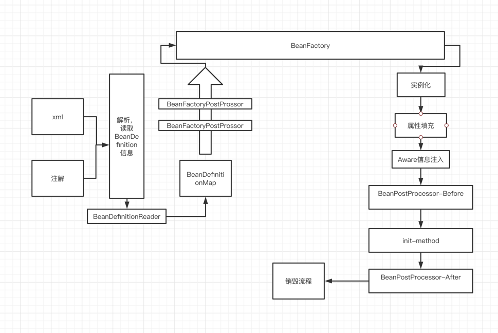

#Spring IOC & AOP

###Sring IOC 流程图

1.创建容器

2.创建读取器（Reader，Scanner）,用于BeanDefinition读取

3.创建Bean工厂

4.创建Bean

###Spring AOP 流程图
Spring AOP 实际上使用了BeanPostProcessor进行实现，在Bean的初始化前后织入代理方法，
而代理对象的生成则是在三级缓存内生成。
AopProxy 是AOP的接口